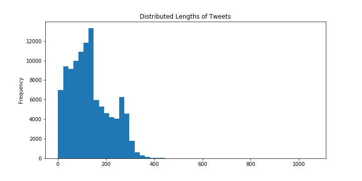

# NLP_finalproject

**Overview:**

An airline has been wanting to improve their reputation with customer and employee experiences.  Since their survey reviews already account for their individual airline they’d like to provide due diligence on the entire industry.

They need help web scraping twitter to perform natural language processing on social media tweets.

**Goals:**
1. Use topic modeling to classify different areas of interest per airline.
2. Use sentiment analysis in order to determine positive and negative tweets.
3. Provide visuals for each airline.

**Data:**

Collect 110,000 tweets using Twint (2018-2019)

4 Major Airlines:
- United Airlines
- American Airlines
- Delta Air Lines
- Alaska Airlines
4 Low-Cost Carrier Airlines
- Southwest Airlines (largest low-cost carrier)
- JetBlue
- Frontier (ultra low)
- Spirit (ultra low)

**Project Presentation:**

https://docs.google.com/presentation/d/1djEjBMIgj4O1GO1v97o0FVsGhJcDT7Eo/edit#slide=id.p1

**Data Evaluation**
The below graph shows the distribution of tweet lengths. Normally the max tweet length is 120 characters. The distribution graph shows differently because it is expanding with pictures and website links. Before we start the vectorization process we want to remove all website and picture links.

View the graph below to view the lengths of tweets between each major airline.

**t-SNE Cluster Analysis**

Below you can see a Coherence score evaluation. Our highest coherence score is .44 with 3 topics. When running a t-SNE Cluster analysis you can see there is not much overlap between each cluster.
We will also run a LDA Visualization.

**Word Clouds**

You can see the three distinct topics shown in the word clouds. The larger the word the heavier the weight between each topic.

**Analysis**

*Major Airlines*

*Low-Cost Carriers*
